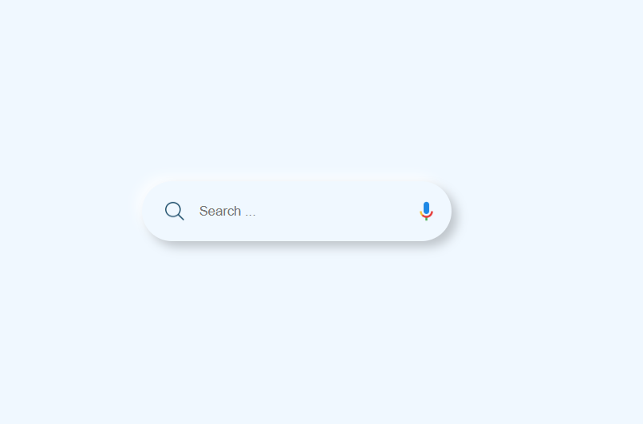

## 💻 How It Works

1. Click on the **magnifier icon**:
   - Expands the container to show the search bar and microphone.
   - Applies neumorphic shadows for depth effect.
2. Click again on the **magnifier**:
   - Animates the collapse and hides the elements smoothly.
3. JavaScript handles toggling by **adding/removing CSS classes** to animate width, opacity, and visibility.

---

## 🧠 What You’ll Learn

- Implement **neumorphic design** in CSS
- Animate HTML elements using transitions
- Use JavaScript to toggle classes and control UI states
- Design interactive components for modern web projects

---

## 📸 Preview

  

*A sleek animated neumorphism search bar with microphone integration.*

---

## 🛠️ Setup Instructions

1. Clone or download this repository.
2. Open `index.html` in your browser.
3. Click the magnifier icon to see the animation in action!

---

## 📌 Future Improvements

- Add real-time voice recognition using Web Speech API.
- Improve accessibility with ARIA attributes.
- Add dark mode toggle with neumorphism variations.

---

## 🧑‍💻 Author

**Tejas Talole**  
Full Stack Web Developer | JavaScript & UI/UX Enthusiast

---

## 📄 License

This project is open-source and free to use for personal or commercial projects.

